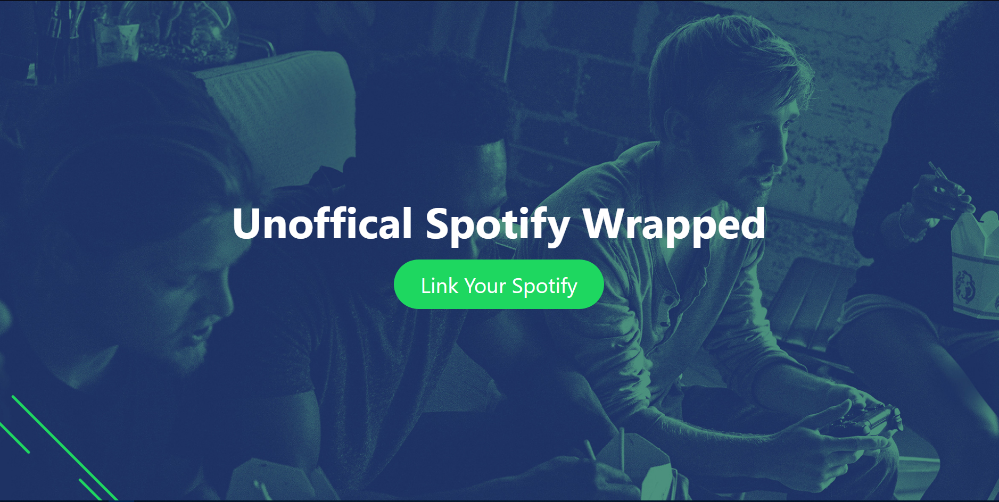
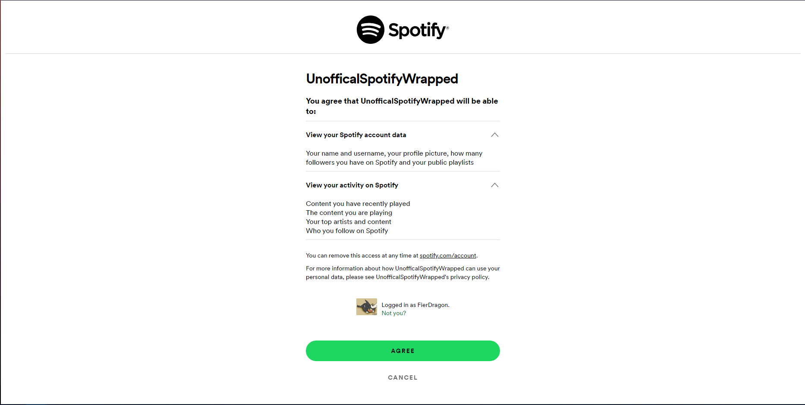
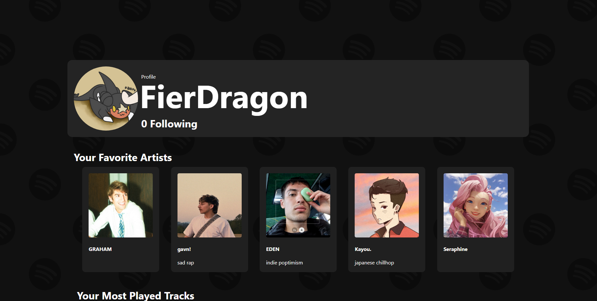
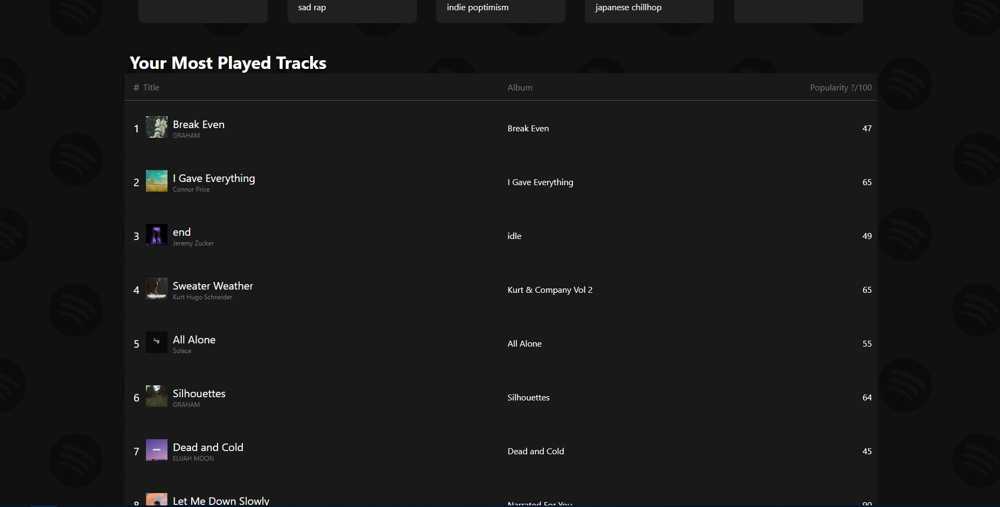
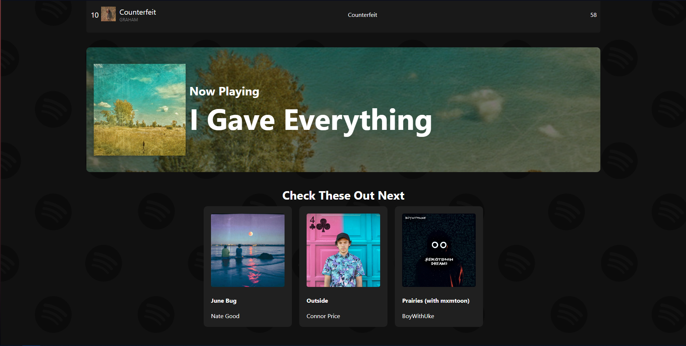

# Spotify-Wrapped

This project was built so that I could practice using API's and user authentication with those API's. Once a year, Spotify shares user stats with the user. I wanted these stats to be viewable 24/7 so I created
The Unoffical Spotify Wrapped

## the starting page for the website

## After clicking the link button, the user is redirected to the spotify authentication page to confirm they want the website to user their account information

## Next the user is redirected to our website again. Here the user information will be called for. During this time there is a loading screen but then the user profile will be displayed

## The users most listened to music will be displayed in this chart

## If the user is currently listening to music, it will be displayed here.

